## LEMP STACK IMPLEMENTATION
To ensure a successful completion of this project, here are some prerequisites:
- Have VS Code and some of it's extensions installed.
- Create AWS account and launch an EC2 Instance
- Firewall rules with port 22 accessible from the internet (0.0.0.0)
- Create a GitHub account and create a personal access token (PAT)
- Create OpenSSH key pair in your local system and use the public key to create SSH key in GitHub

Below are the steps I followed to implement a LAMP STACK in AWS
### 1.  Install NGINX Server and Update the Firewall Rule
- Connect to the EC2 instance
On my local PC, I opened the folder created above and saved the downloaded key from AWS. Then I launched my VS Code, clicked on Terminal and ran the following commands.
```
# Grant permission to access and use the key
sudo chmod 400 devops-practice-key1.pem 

# ssh into the EC2 instance
ssh -i devops-practice-key1.pem ubuntu@ec2-3-91-222-235.compute-1.amazonaws.com
```

- Install nginx server
To install Nginx server, I had to update the apt packages first before using it to install Nginx. Below are the commands used: 
```
#update a list of packages in package manager
sudo apt update -y

#run Nginx package installation
sudo apt install nginx -y

#confirm that Nginx is running
sudo systemctl status nginx
```

**Result screenshot:**
<br />
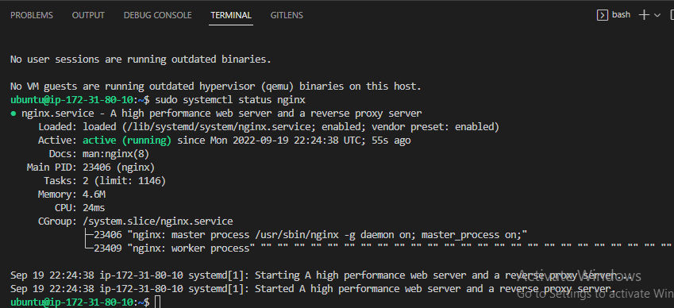

- Confirm that Nginx server is rendering from within the EC2 instance
`curl http://localhost:80`

**Result Screenshot:**
<br />
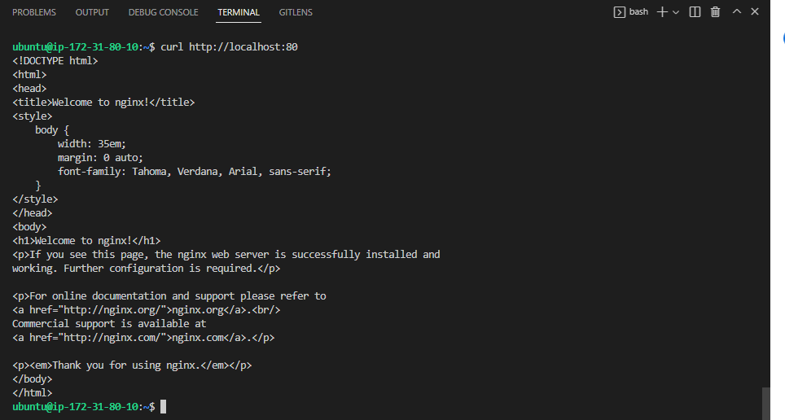

- Update the firewall rules
To enable users to access the web server over the internet, I had to open port 80 (for HTTP traffic) using the AWS console. I created a new inbound rule in the security group attached to the EC2 instance with port 80 open to traffic from anywhere.

**Result Screenshot:**
<br />
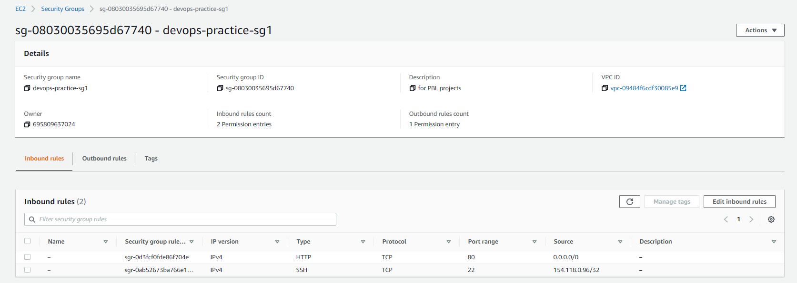

- Test if you can access Nginx server from the internet
To test, I used the command `curl -s http://169.254.169.254/latest/meta-data/public-ipv4` to obtain the public IP address of my EC2 instance and then navigated to that IP address using the web browser of my local system.

**Result Screenshot:**
<br />
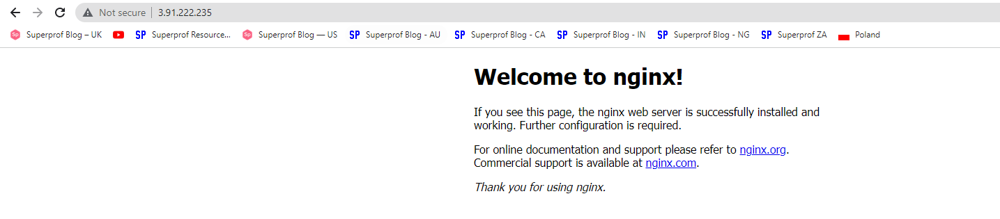

### 2.  Install MySQL Database
I followed the steps below to install and configure MySQL:

- use apt package installer to install MySQL
```
sudo apt install mysql-server -y
```

- Connect to the MySQL server as the administrative database user root
```
sudo mysql
```
**Result Screenshot:**
<br />
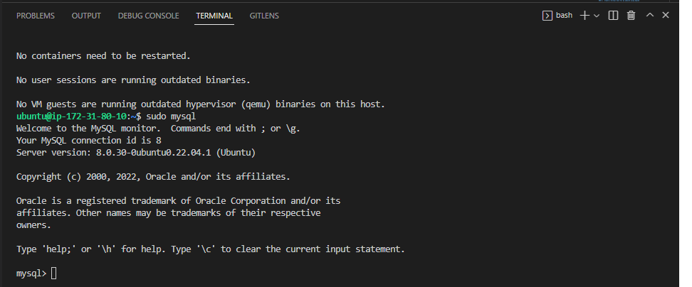

- Set password for the system root user and exit the shell
```
#set password
ALTER USER 'root'@'localhost' IDENTIFIED WITH mysql_native_password BY 'PassWord.1';

#exit shell
exit
```

- Run a security script that comes pre-installed with MySQL. This script will remove some insecure default settings and lock down access to your database system.
```
sudo mysql_secure_installation
```

- To configure the VALIDATE PASSWORD PLUGIN, select Yes when prompted. If the feature is enabled, passwords which don’t match the specified criteria will be rejected by MySQL with an error.

- Set the MySQL root password.

- Press Y and hit the ENTER key when prompted to change the root password, remove some anonymous users and the test database, disable remote root logins, and load these new rules so that MySQL immediately respects the changes you have made.

- Test logging into the MySQL console
```
sudo mysql -p
```

**Result Screenshot:**
<br />
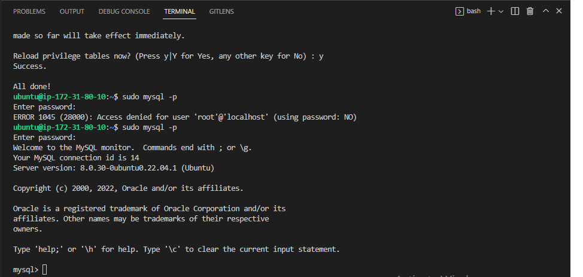

**Note:** At the time of this writing, the native MySQL PHP library mysqlnd doesn’t support caching_sha2_authentication, the default authentication method for MySQL 8. For that reason, when creating database users for PHP applications on MySQL 8, you’ll need to make sure they’re configured to use mysql_native_password instead.

### 3.  Install PHP
To have PHP working as needed with Nginx, I had to install these two packages: 'PHP fastCGI process manager' (php-fpm) and a PHP modulethat allows PHP to communicate with MySQL-based databases (php-mysql).

- Install the needed packages
```
sudo apt install -y php-fpm php-mysql
```

**Result Screenshot:**<br />
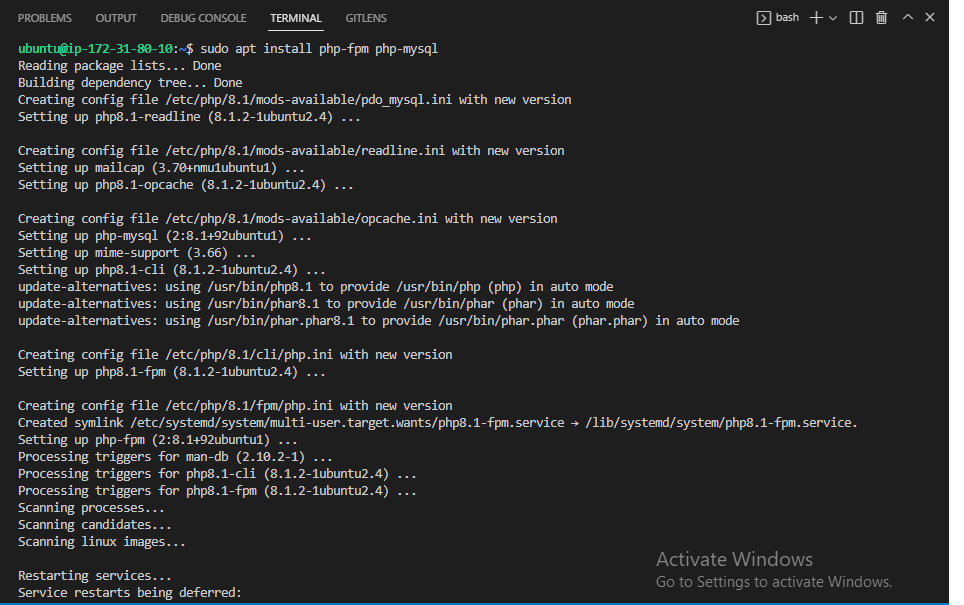

### 4.  Configure Nginx to use PHP processor
To configure Nginx to use PHP processor, below are the steps I followed:

- Create a directory called myconsult
```
sudo mkdir /var/www/myconsult
```

- Assign ownership of the directory to my current user
```
sudo chown -R $USER:$USER /var/www/myconsult
```

- Create and open a new configuration file in Nginx’s sites-available directory
```
sudo vi /etc/nginx/sites-available/myconsult
```

- Paste the following configurations inside the configuration file, save and close.
```
#/etc/nginx/sites-available/myconsult

server {
    listen 80;
    root /var/www/myconsult;

    index index.html index.htm index.php;

    location / {
        try_files $uri $uri/ =404;
    }

    location ~ \.php$ {
        include snippets/fastcgi-php.conf;
        fastcgi_pass unix:/var/run/php/php8.1-fpm.sock;
     }

    location ~ /\.ht {
        deny all;
    }

}
```

- Link to the config file from Nginx's sites-enabled directory to activate the configuration
```
sudo ln -s /etc/nginx/sites-available/myconsult /etc/nginx/sites-enabled/
```

- Check for syntax errors in configuration
```
sudo nginx -t
```

**Result Screenshot:**<br />
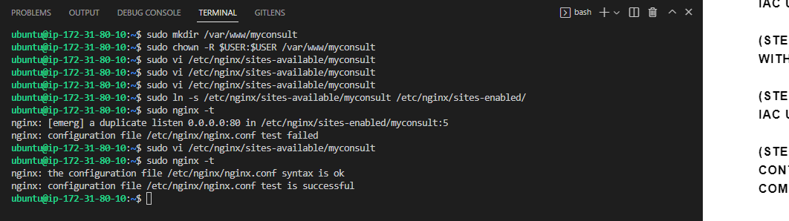

- Disable default Nginx host that is currently configured to listen on port 80
```
sudo unlink /etc/nginx/sites-enabled/default
```

- Reload Nginx for the changes to take effect
```
sudo systemctl reload nginx
```

- Create an index.html file in the root directory of my website '/var/www/myconsult/'
```
sudo echo 'Hello LEMP from hostname' $(curl -s http://169.254.169.254/latest/meta-data/public-hostname) 'with public IP' $(curl -s http://169.254.169.254/latest/meta-data/public-ipv4) > /var/www/myconsult/index.html
```

- Test if everything worked as expected by naviagting to the address: http://3.91.222.235:80

**Result Screenshot:**<br />
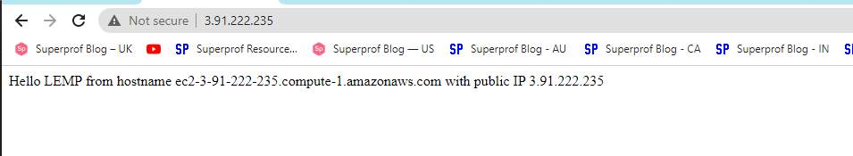


### 5.  Testing PHP with Nginx
To test if .php files can be handled by PHP processor, I performed the following:

- Create and open an info.php file
```
sudo vi /var/www/myconsult/info.php
```

- Paste the following configuration inside the file, save and close it
```
<?php
phpinfo();
```

- Tested if I could access the page via my web browser
```
http://server_IP/info.php 
```
In my case:
```
http://3.91.222.235/info.php
```

**Result Screenshot:**<br />
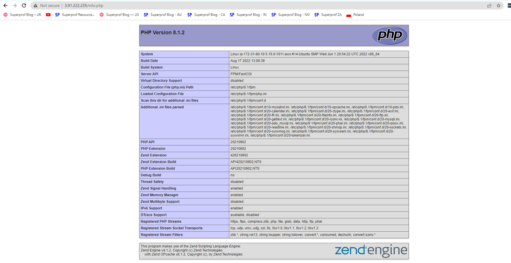

**Note:** Use the command below to remove the info.php file from the website root directory when done, as it exposes key information about the PHP environment.<br />
```
sudo rm /var/www/myconsult/info.php
```

### 5.  Retrieving Data from MySQL Database with PHP
To achieve the aim in this section, I created a test database (DB) with simple "To do list" and configured access to it, so the Nginx website would be able to query data from the DB and display it.

**Note:** At the time of implementing this project, the native MySQL PHP library mysqlnd doesn’t support caching_sha2_authentication, the default authentication method for MySQL 8. We’ll need to create a new user with the mysql_native_password authentication method in order to be able to connect to the MySQL database from PHP.

- Connect to the MySQL console using the root account
```
sudo mysql
```

- Create a new Database 'demo_db'
```
CREATE DATABASE `demo_db`;
```

- Create a new user 'demo_user' with password 'demo_password'
```
CREATE USER 'demo_user'@'%' IDENTIFIED WITH mysql_native_password BY 'demo_password';
```

- Give the demo_user permission with full privilege to access the database and exit MySQL
```
#grant user permission
GRANT ALL ON demo_db.* TO 'demo_user'@'%';

#exit MySQL
exit
```

- To test if the newly created user has full permission, log in to the MySQL console using the user credentials and then run different queries

```
#login to demo_db
mysql -u demo_user -p

#confirm access to demo_db
SHOW DATABASES;

#create a test table 'demo_table'
CREATE TABLE demo_db.demo_table (
    item_id INT AUTO_INCREMENT,
    content VARCHAR(255),
    PRIMARY KEY(item_id)
);

#insert few rows of content in the demo_table
INSERT INTO demo_db.demo_table (content) VALUES ("My first important item");
INSERT INTO demo_db.demo_table (content) VALUES ("My second important item");
INSERT INTO demo_db.demo_table (content) VALUES ("My third important item");
INSERT INTO demo_db.demo_table (content) VALUES ("My fourth important item");

#confirm that the data was successfully saved to your table
SELECT * FROM demo_db.demo_table;
```
**Result Screenshot: Database Created**<br />
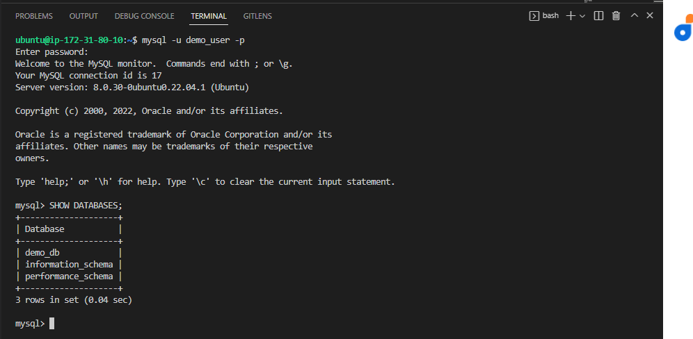

**Result Screenshot: Data saved successfully**<br />
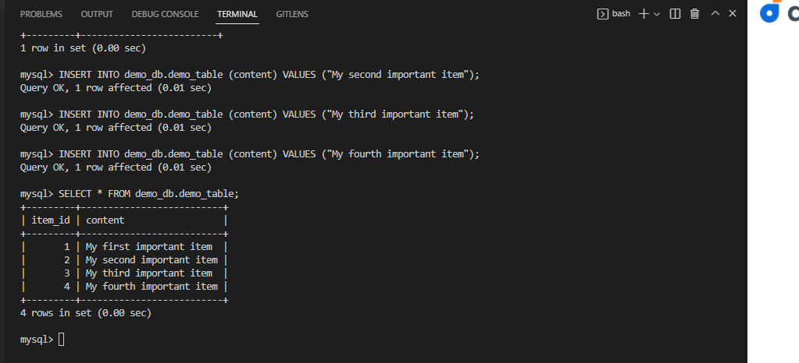

- Exit MySQL Database
```
exit
```

-  Create a PHP script that will connect to MySQL and query for your content
To achieve my aim, I created a new PHP file 'data.php' in the custom web root directory.
```
sudo vi /var/www/myconsult/data.php
```

- Paste the following content inside the file, save and close it
```
<?php
$user = "demo_user";
$password = "demo_password";
$database = "demo_db";
$table = "demo_table";

try {
  $db = new PDO("mysql:host=localhost;dbname=$database", $user, $password);
  echo "<h2>TODO</h2><ol>";
  foreach($db->query("SELECT content FROM $table") as $row) {
    echo "<li>" . $row['content'] . "</li>";
  }
  echo "</ol>";
} catch (PDOException $e) {
    print "Error!: " . $e->getMessage() . "<br/>";
    die();
}
```

- Tested if I could access the data via my web browser
```
http://server_IP/data.php 
```
In my case:
```
http://3.91.222.235/data.php
```

**Result Screenshot:**<br />
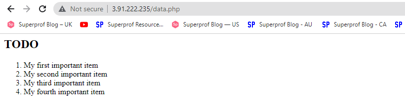


Credit: [This guide was inspired by Digital Ocean](https://www.digitalocean.com/community/tutorials/how-to-install-linux-nginx-mysql-php-lemp-stack-on-ubuntu-20-04)


